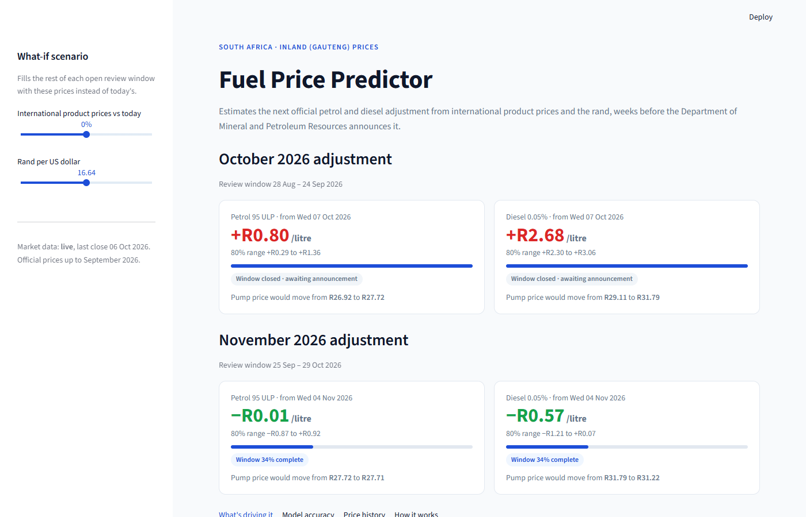

# SA Fuel Price Predictor

Predicts South Africa's next official petrol and diesel price adjustment from live
international product prices and the rand, weeks before the Department of Mineral and
Petroleum Resources (DMPR) announces it.

**Live app: [sa-fuel-price-predictor.streamlit.app](https://sa-fuel-price-predictor.streamlit.app/)**



## Why

Fuel is an input to almost everything in the SA economy: transport, food, farming and
logistics. Fleet operators, taxi associations, farmers and households all plan around the
monthly adjustment, but the official number only arrives a few days before it takes effect.
Because the price is regulated by a published formula, most of the change can be worked out
early from market data.

## How it works

1. **The rule.** The adjustment on the first Wednesday of a month follows the change in the
   Basic Fuel Price, which tracks international product prices converted to rand and averaged
   over a review window (roughly the last Friday of one month to the last Thursday of the next).
2. **Features.** For every adjustment since 2012 the app averages RBOB gasoline futures
   (petrol) and NY Harbor ULSD futures (diesel) over that window, converts them to cents per
   litre at the window's average USD/ZAR rate, and takes the month-on-month change.
3. **Model.** A Huber (robust) regression of the actual pump price change on that change, plus
   an April term for the annual fuel levy increase. The robust loss keeps one-off policy
   decisions such as levy relief from distorting the fit.
4. **Nowcast.** While a window is still open, elapsed days use real market prices and the
   remaining days use today's price, or the what-if scenario set in the sidebar. The change is
   split into an oil-price effect and an exchange-rate effect.

## Accuracy

Walk-forward backtest, January 2016 to September 2026: every month is predicted by a model
trained only on the months before it.

| Fuel            | Mean absolute error | "No change" baseline | Direction correct | R²   |
|-----------------|--------------------:|---------------------:|------------------:|-----:|
| Petrol 95 ULP   | 35 c/l              | 65 c/l               | 84%               | 0.69 |
| Diesel 0.05%    | 33 c/l              | 80 c/l               | 90%               | 0.76 |

The largest misses are policy decisions that are not visible in market data: the temporary
fuel levy relief in 2022 and 2026, slate levy changes, and margin reviews.

## Data

| Data | Source |
|------|--------|
| Official Gauteng prices, 2012 onwards | [Fuels Industry Association of SA](https://fuelsindustry.org.za/consumer-information/fuel-prices-current-past/) |
| Most recent months | [Petrol Pulse](https://www.petrolpulse.co.za/fuel-price-history), checked against DMPR media statements |
| Futures, Brent and USD/ZAR | Yahoo Finance via `yfinance` (a snapshot is bundled in case it is unavailable) |

`scripts/build_prices.py` rebuilds `data/fuel_prices.csv`. It fixes the lost decimal points in
the source tables, checks that the two sources agree where they overlap, and applies documented
corrections.

## Run locally

```bash
python -m venv .venv
.venv\Scripts\activate          # macOS/Linux: source .venv/bin/activate
pip install -r requirements.txt
streamlit run app.py
```

Tests: `pip install pytest && pytest`

## Project layout

```
app.py                  Streamlit app
fuelcast/windows.py     DMPR review-window calendar
fuelcast/market.py      Market data download and rand-per-litre conversion
fuelcast/model.py       Feature table, Huber regression, backtest, nowcast
scripts/build_prices.py Rebuilds the official price history
data/                   Price history and market snapshot
tests/                  Window calendar and model tests
```

## Limitations

- Inland (Gauteng) prices only; coastal prices are usually about 80 c/l lower.
- US futures are a proxy for the Mediterranean, Singapore and Arab Gulf spot prices the DMPR
  uses, so refinery-margin shocks between regions show up as error.
- Not financial advice.

## Author

Tshilidzi Mugeri · [GitHub](https://github.com/tshilidzimugeri-rgb)
